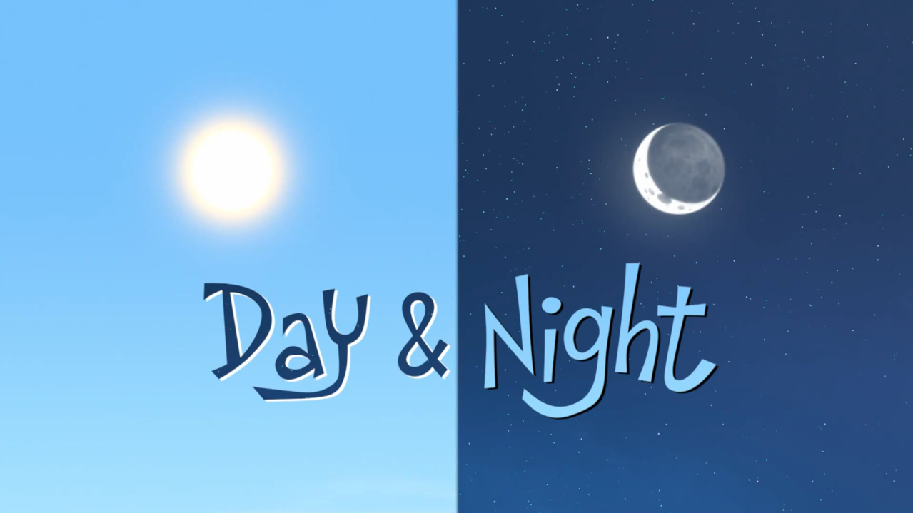

# Applied Data Science @ Columbia
## Fall 2019
## Project 1: A "data story" on the songs of our times


### [Project Description](doc/)
This is the first and only *individual* (as opposed to *team*) this semester. 

Term: Fall 2019

+ Project title: "Day" and "Night" Exploration by Five W's
+ This project is conducted by Yang Meng

+ Project summary: Here I explore the frequency change of word "day" and "night" in lyrics overtime, and find some reasons behind together with some other phenomena. Basically, this study used some techniques of text mining and visualization, analyzing word proportion change overtime, checking details in different genres and regions, and going deeper to analyze a typical genre Metal and its development. The results showed that the decrease of "night" frequency around 2000, which was opposite to that of "day", was caused by the occurrence of a subgenre of Metal music, Nu Metal. The results also showed the preference of these two words in different regions.



### [Project Report](doc/project_1_report.html)

### [Project Code](doc/project_1_report.Rmd)

Following [suggestions](http://nicercode.github.io/blog/2013-04-05-projects/) by [RICH FITZJOHN](http://nicercode.github.io/about/#Team) (@richfitz). This folder is orgarnized as follows.

```
proj/
├── lib/
├── data/
├── doc/
├── figs/
└── output/
```

Please see each subfolder for a README file. 
