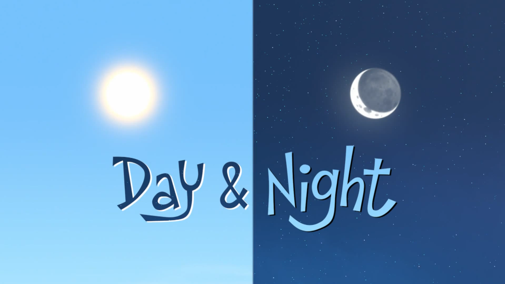

```{r setup, include=FALSE}
knitr::opts_chunk$set(echo = TRUE)
```

```{r, warning=FALSE, message=FALSE, echo=F}
packages.used=c("data.table", "tidytext", "tidyverse", "devtools", "ggplot2", "gridExtra", "ngram", "usmap", "Rmisc")
packages.needed=setdiff(packages.used, 
                        intersect(installed.packages()[,1], 
                                  packages.used))
if(length(packages.needed)>0){
  install.packages(packages.needed, dependencies = TRUE)
}
devtools::install_github("lchiffon/wordcloud2", force = T, quiet = T)
```


```{r load libraries, warning=FALSE, message=FALSE, echo=F}
library(data.table)
library(tidytext)
library(tidyverse)
library(devtools)
library(ggplot2)
library(wordcloud2)
library(gridExtra)
library(ngram)
library(usmap)
library(Rmisc)
```

{width=100%}

```{r load data, warning=FALSE, message=FALSE, echo=F}
# load lyrics data
load('../output/processed_lyrics.RData') 
# load artist information
dt_artist <- fread('../data/artists.csv') 
```


# Why?

I used the given cleaned data with stemmed words to do the project. By converting all the letters to the lower case, and removing punctuation, numbers, empty words and extra white space, the data cleaning has been done by the given code. After word stemming and stem completion part, I used the output file "processed_lyrics.RData" to do the exploration. First I want to take a brief look at the overall frequency of words in lyrics.

From the wordcloud plot of all the stemmed words, we can see high frequency words. Just ignore those "youre"s and "ill"s, because they come from "you're" and "I'll" in the original texts. These words can be cleaned, however, I will only focus on something else, so it doesn't matter to clean them or not.

These two words, "day" and "night" really interest me, because it may show the artists' preference of telling stories about daytime or nighttime. So I want to extract information about these two words, and try to find the story behind them.

```{r, echo=F}
stem_all <- strsplit(dt_lyrics$stemmedwords, " ") %>% unlist() %>% table() %>% as.data.frame() %>% arrange(desc(Freq))
```

```{r, echo=F}
wordcloud2(stem_all %>% slice(1:50), size = 1, color = "firebrick")
```

```{r, echo=F}
word_list <- c("day", "night")
time_list <- seq(1970, 2010, 5)
ratio_word <- c()
for (word in word_list){
for (time in time_list){
  lyric_test <- dt_lyrics %>% filter(year >= time) %>% filter(year < (time+5))
  stem_test <- strsplit(lyric_test$stemmedwords, " ") %>% unlist() %>% table() %>% as.data.frame() %>% arrange(desc(Freq)) %>% filter(. == word)
  stem_all <- length(strsplit(lyric_test$stemmedwords, " ") %>% unlist())
  ratio_word <- c(ratio_word, (stem_test$Freq / stem_all))
}}
```


# When?

First let's take a look at the change of artists' preference of "day" or "night" every five years from 1970 to 2015 (the latest data is from 2016).

From the barplot, we can see a trend of "day" and "night" frequency throughout these years. For most of the time, the change of "day" and "night" frequency are similar, which means the proportion of word "day" and "night" grow or fall together in a period. However, there are two periods to be noticed, the 1970's, and around 2000. In the 1970's, the total number of lyrics is small, and it was too far away from nowadays, so I don't want to explore it too much. 

The thing I noticed is, when it came to 21st century, the proportion of word "day" increased a little, but the proportion of "night" decreased a lot! This anti-trend phenomenon interests me, so I will try to find the reasons and other hidden phenomena behind it.


```{r, echo=F}
word_name <- rep(word_list, each=9)
pop_word <- data.frame(word_name, time_list, ratio_word)
pop_dn <- pop_word %>% filter(word_name %in% c("day", "night"))
ggplot(pop_dn, aes(x=time_list, y=ratio_word, colour=word_name, group=word_name)) + 
  geom_line(position=position_dodge(0.2)) + 
  geom_point(position=position_dodge(0.2), size=1) +
  ylim(0.004, 0.011) + labs(fill = "t") +
  ggtitle("Day & Night Proportion Change over Time") + xlab("Time") + ylab("Proportion") +
  scale_color_manual(values=c('gold2','black'))
```


# Who?

To find the reasons behind the anti-trend phenomenon, the first approach comes to my mind is, to find the contributor to it. In other words, we want to know which genre made the decrease in the frequency of word "night".

From the histogram below, we can see that Rock, Pop, Metal and Hip-Hop are the highest four in total number of songs. What is more, these 4 genres make more than 80 percent of all the songs, so we may assume that they can decide the word frequency. 

```{r, echo=F}
imp <- dt_lyrics$genre %>% table() %>% as.data.frame() %>% arrange(desc(Freq))
ggplot(data=imp[-7,], aes(x=reorder(., -Freq), y=Freq)) +
  geom_bar(stat="identity") + 
  ggtitle("Genre Frequency") + xlab("Genre") + ylab("Frequency")
```

```{r, echo=F}
lyrics_list_4 <- c("Rock", "Metal", "Pop", "Hip-Hop")
time_list <- c(1995, 2000)
dn_genre <- c()
for (t in time_list){
d10 <- c()
n10 <- c()
lyric_10 <- dt_lyrics %>% filter(year >= t) %>% filter(year < t + 5)
for(s in lyrics_list_4){
  lyric_test <- lyric_10 %>% filter(genre == s)
  stem_test <- strsplit(lyric_test$stemmedwords, " ") %>% unlist() %>% table() %>% as.data.frame() %>% arrange(desc(Freq))
  stem_all <- length(strsplit(lyric_test$stemmedwords, " ") %>% unlist())
  d <- (stem_test[stem_test$.=="day",2] / stem_all)
  n <- (stem_test[stem_test$.=="night",2] / stem_all)
  d10 <- c(d10, ifelse(length(d),d,0))
  n10 <- c(n10, ifelse(length(n),n,0))
}
dn_genre <- c(dn_genre, d10, n10)
}
```

The two barplots below are really interesting. For word "day", 2 of the four main genres were going up, while the other 2 of them were going down, which implies the proportion will not change too much. The thing to be noticed is, the largest genre, Rock, contributed a slight increase in the proportion of "day", so the overall proportion of word "day" also went up around 2000.

For word "night", the proportion of all of the main genres were going down except Rock. Although Rock is the largest genre, its proportion of "night" before 2000 was too small, so it didn't make the proportion of "night" increase.

Now let's look at the plots from another angle, for Hip-Hop and Pop, the proportion of "day" and "night" both went down around 2000. For Rock, both were going up. For Metal, the proportion change of words "day" and "night" are different around 2000. Only Metal had different directions in proportion of "day" and "night", which was the same as the overall trend. So an important reason of the different direction of change in "day" and "night" is, the genre Metal led the difference.

```{r, echo=F}
decade4plot <- rep(c("1995-2000", "2000-2005"), each=2)
dn4plot <- rep(c("day", "night"), 2)
rock4plot <- data.frame(dn = dn_genre[c(1,2,9,10)], decade4plot, word=dn4plot)
metal4plot <- data.frame(dn = dn_genre[c(3,4,11,12)], decade4plot, word=dn4plot)
pop4plot <- data.frame(dn = dn_genre[c(5,6,13,14)], decade4plot, word=dn4plot)
hiphop4plot <- data.frame(dn = dn_genre[c(7,8,15,16)], decade4plot, word=dn4plot)
plot4genre <- function(gp, gn, y=""){
p <-
ggplot(gp, aes(x=decade4plot, y=dn, colour=word, group=word)) + 
  geom_line(size=1) + geom_point(size=2) + ggtitle(gn) +
  xlab("") + ylab(y) + 
  scale_color_manual(values=c('gold2','black')) + ylim(.002,.011)
}
p1 <- plot4genre(rock4plot, "Rock", y="Proportion")
p2 <- plot4genre(metal4plot, "Metal", y="Proportion")
p3 <- plot4genre(pop4plot, "Pop")
p4 <- plot4genre(hiphop4plot, "Hip-Hop")
multiplot(p1, p2, p3, p4, cols = 2)
```

# What?

As we know, the different direction of "day" and "night" proportion change around 2000 was caused mainly by genre Metal. So to look deeper, I extract all the trigrams with "day" or "night" in the middle to take a look at what the artists were talking about day and night.

```{r,echo=F}
mytri <- function(start_year){
  dt_sub <- filter(dt_lyrics, genre %in% c("Metal")) %>% filter(year>=start_year) %>% filter(year<start_year+5)
  lyric_trigrams <- dt_sub %>% unnest_tokens(trigram, stemmedwords, token = "ngrams", n = 3)
  trigrams_count <- lyric_trigrams$trigram %>% table() %>% as.data.frame() %>% arrange(desc(Freq))
  colnames(trigrams_count) <- c("tri", "freq")
  return(trigrams_count)
}

mywc <- function(trigrams_count, w2, s=.3, c, b){
  trinight <- trigrams_count %>% separate(tri, c("word1", "word2", "word3"), sep = " ") %>% filter(word2 == w2)
  trinight$word <- apply(trinight[c(1, 3)], 1, paste, collapse = " " )
  wordcloud2(trinight[,c(5,4)] %>% slice(1:50), size=s, color = c, backgroundColor = b)
}
```


{width=100%}

The phemonema explains the decrease in proportion "night" and the increase in "day". I need to introduce Nu Metal here, which is a new subgenre of Metal developed in the late 1990's, and then became a huge part of Metal in 21st century. The presense of Nu Metal changed Metal a lot. As Josh Chesler of the Phoenix New Times, the lyrics of Deftones, who were once in a Nu Metal band said, "tend to have complex allusions and leave the songs open to many different interpretations" (from Wikipedia), Nu Metal wanted to have more topics in the lyrics, rather than talking about blood, death and dark over and over again. Naturally, the proportion of "night" decreased together with these traditional Metal topics, because these elements are always associated with nights.

From the wordcloud below, we can see that the trigrams about day and night were becoming happy, not just about dark, devil, or blood, which are typical topics for traditional Metal music. 

For "night", they used to talked more about "devil", "blood", "cry", and "dead", but in 21st century it became more about "party" and "illuminate". It is the same case in word "day", the high-frequency topics were changed from "bane" and "broken" to "lady" and "baby". 

**1995-2000 Night**

```{r,echo=F}
mywc(mytri(1995), "night", .25, c = "blue", b="black")
```

**2000-2005 Night**

```{r,echo=F}
mywc(mytri(2000), "night", .5, c = "pink", b="black")
```

**1995-2000 Day**

```{r,echo=F}
mywc(mytri(1995), "day", .4, c="darkred", b="lightblue")
```

**2000-2005 Day**

```{r,echo=F}
mywc(mytri(2000), "day", c="red", b="lightblue")
```

# Where?

Finally, let's see the preference of "day" or "night" in different areas in the world. 
From the histogram below, wee don't see a significant difference between America and other countries in the preference of day or night topics. Other countries may prefer "night" a little bit more compared to America.

```{r, echo=F}
dt_artist$abbr <- sub(".*\\s","",dt_artist$Origin)
colnames(dt_artist) <- c("artist", "Intro", "Formed", "Members", "Origin","abbr")
data_all <- merge(dt_lyrics, dt_artist, by="artist", all.x=T)
```

```{r, echo=F}
usa <- data_all %>% filter(abbr %in% statepop$abbr)
international <- data_all %>% filter(!(abbr %in% statepop$abbr)) %>% filter(abbr != "")
unknown <- data_all %>% filter(abbr == "")
```

```{r, echo=F}
dn_world <- rbind(
  strsplit(usa$stemmedwords, " ") %>% unlist() %>% table() %>% as.data.frame() %>% arrange(desc(Freq)) %>% filter(. == "day" | . == "night"),
  strsplit(international$stemmedwords, " ") %>% unlist() %>% table() %>% as.data.frame() %>% arrange(desc(Freq)) %>% filter(. == "day" | . == "night"),
  strsplit(unknown$stemmedwords, " ") %>% unlist() %>% table() %>% as.data.frame() %>% arrange(desc(Freq)) %>% filter(. == "day" | . == "night")
)
```

```{r, echo=F}
dn_world$name <- c("America","America","International","International","Unknown","Unknown")
ggplot(data=dn_world, aes(x=name, y=Freq, fill=.)) +
  geom_bar(stat="identity", color="black", position=position_dodge()) + 
  scale_fill_manual(values=c('gold','grey')) + 
  xlab("Areas") + ylab("Frequency") + ggtitle("Worldwide \"day\" and \"night\" Preference")
```

Let's take a more detailed look at American lyrics. I used the log ratio of frequency of "day" over "night" to measure the preference of "day" or "night" in different states in the USA. The state likes word "day" the most will be filled in yellow, and that of "night" will be black. From the map below, we see that the middle part of USA prefers "day", and the south and north parts prefer "night". What is more, highly developed states like New York and California have more topics of nights. It makes sense considering the wonderful nightlives there.

```{r, echo=F}
dn <- data.frame(abbr = statepop$abbr, ratio = rep(NA, 51))
i = 1
for (state in statepop$abbr){
  lyric_test <- data_all %>% filter(abbr == state)
  stem_test <- strsplit(lyric_test$stemmedwords, " ") %>% unlist() %>% table() %>% as.data.frame() %>% arrange(desc(Freq)) %>% filter(. == "day" | . == "night")
  ratio <- (stem_test[stem_test$.=="day",2] / stem_test[stem_test$.=="night",2])
  dn[i, 2] <- ifelse(length(ratio), log(as.numeric(ratio)), NA)
  i = i+1
}
dataformap_dn <- merge(statepop, dn, "abbr")
```

```{r, echo=F}
plot_usmap(data = dataformap_dn, values = "ratio", labels=T, label_color = "white", color="white") +
    scale_fill_continuous(name = "log(day/night)", low = "black", high = "gold", label = scales::comma)+
    theme(legend.position = "right")
```

# Future Work

**Missing Values**

As we can see in the previous histogram and map, there are some grey areas which represent NA's in the data. Actually, the column "Origin" does contain some NA's, but another column "Introduction" has some information about the original areas of those artists. So next time I will try to extract area information from column "Introduction" to deal with the "NA" problem.

**Region Classification together with Time and Genre**

If we do time and genre classification together with region classification, the "day" and "night" preference will be analyzed more detailed. Then we can see the pattern of how the word frequency changed through all these years in different regions of different genres, and which variables influence the preference most. So next time I will try do this, and visualize the pattern in a clear way.

# Summary

1. Proportion of "day" and "night" change in the same direction for most of the time, except the end of 20th century to the beginning of 21st century, when proportion of "day" increased a little and that of "night" decreased a lot.

2. Metal music played an important role in the trend around 2000, because only genre "Metal" showed the same direction to the trend among four main genres, Rock, Pop, Metal, and Hip-Hop.

3. Metal talked about nights less and less, starting from the end of 20th century. Maybe it was caused by the occurrence of the new subgenre Nu Metal, which tended to leave the songs open to more different interpretations, and that changed the once high frequency of word "night" which can represent dark and scary elements in the traditional Metal lyrics.

4. Middle parts of the USA and highly developed regions prefer "day" in lyrics more rather than "night" compared to the south and north. 

